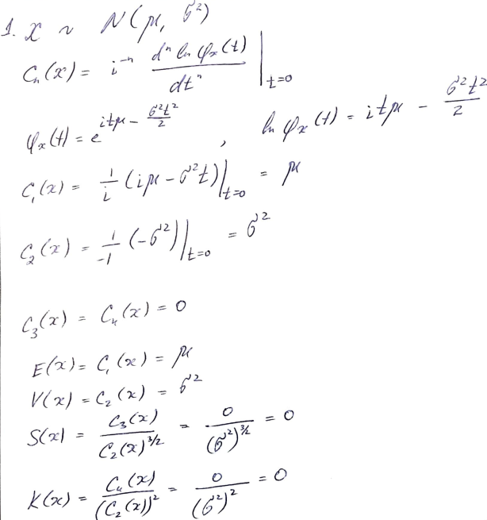
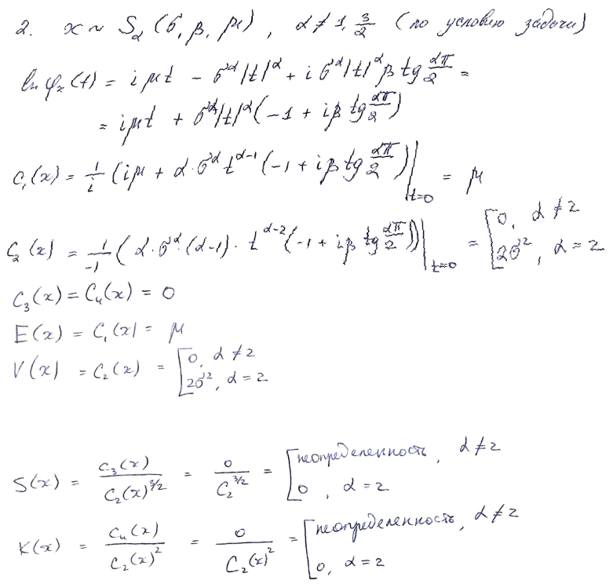
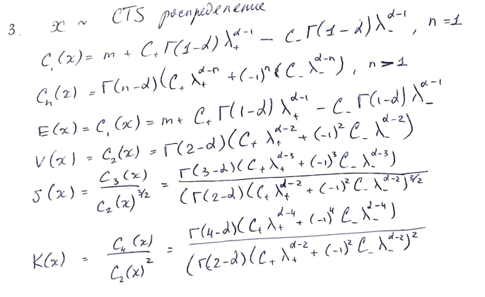

## Описание задания 1

1. Рассмотреть 3 распределения, для каждого необходимо построить график
плотности распределения (если плотность распределения неизвестна, то по
характеристической функции найти плотность), функции распределения, характеристической функции.
2. Провести анализ параметров распределения и графиков плотности распределения 
(одни параметры изменяются, остальные фиксированые).
3. Вычислить семиинварианты и найти E(x), V(x), S(x) и K(x) через них.
4. Найти квантили: верхний, средний (медиана), нижний и показать как меняются
квантили при изменении параметров распределения.


```{r}
library(ggplot2)
library(stabledist)
library(ggforce)
library(SymTS)

set.seed(1234)
x <- seq(-7, 7, 0.1)

```

# Нормальное распределение
```{r}
mean1 <- -3
mean2 <- 0
mean3 <- 3
sd1 <- 1
sd2 <- 0.7
sd3 <- 0.5

distr_by_mean <- data.frame(cond = factor(rep(c(mean1, mean2, mean3), each=length(x))), 
                     rating = c(dnorm(x, mean=mean1, sd=sd1),
                                dnorm(x, mean=mean2, sd=sd1),
                                dnorm(x, mean=mean3, sd=sd1)), x=x)

ggplot(distr_by_mean, aes(x=x, y=rating, color = cond)) +
  geom_line() + 
  labs(col = "мат ожидание") + 
  xlab("значение случайной величины") + 
  ylab("значение плотности распределения")
  
distr_by_sd <- data.frame(cond = factor(rep(c(sd1, sd2, sd3), each=length(x))), 
                            rating = c(dnorm(x, mean=mean2, sd=sd1),
                                       dnorm(x, mean=mean2, sd=sd2),
                                       dnorm(x, mean=mean2, sd=sd3)), x=x)

ggplot(distr_by_sd, aes(x=x, y=rating, color = cond)) +
  geom_line() + 
  labs(col = "дисперсия") + 
  xlab("значение случайной величины") + 
  ylab("значение плотности распределения")
  
```

## Выводы:

1. Изменение мат ожидания смещает график плотности распределения
2. Изменение дисперсии сжимает, либо вытягивает график плотности распределения


```{r}
print_quant_norm <- function(mean, sd){
  x = c(0.25, 0.5, 0.75)
  print(paste0("мат ожидание = ", mean))
  print(paste0("дисперсия = ", sd))
  quantiles <- paste(qnorm(x, mean=mean, sd=sd), collapse = ", ")
  print(paste0("квантили = ", quantiles))
}
print_quant_norm(mean1, sd1)
print_quant_norm(mean2, sd1)
print_quant_norm(mean3, sd1)

print_quant_norm(mean1, sd1)
print_quant_norm(mean1, sd2)
print_quant_norm(mean1, sd3)

```



*****

\pagebreak

# Устойчивое распределение
```{r warning=FALSE}
alpha1 <- 0.5
alpha2 <- 0.9
alpha3 <- 2

beta1 <- 0.5
beta2 <- 0
beta3 <- 1

gamma1 <- 2
gamma2 <- 1
gamma3 <- 3

delta1 <- -1
delta2 <- 0
delta3 <- 1
  
  
distr_by_alpha <- data.frame(cond = factor(rep(c(alpha1, alpha2, alpha3), each=length(x))),
                             x=x,
                            rating = c(dstable(x, alpha=alpha1, beta=beta2, gamma=gamma2, delta = delta2),
                                       dstable(x, alpha=alpha2, beta=beta2, gamma=gamma2, delta = delta2),
                                       dstable(x, alpha=alpha3, beta=beta2, gamma=gamma2, delta = delta2)))

ggplot(distr_by_alpha, aes(x=x, y=rating, color = cond)) +
  geom_line() + 
  labs(col = "значение alpha") + 
  xlab("значение случайной величины") + 
  ylab("значение плотности распределения")


distr_by_beta <- data.frame(cond = factor(rep(c(beta1, beta2, beta3), each=length(x))),
                            x=x,
                             rating = c(dstable(x, alpha=alpha2, beta=beta1, gamma=gamma2, delta = delta2),
                                        dstable(x, alpha=alpha2, beta=beta2, gamma=gamma2, delta = delta2),
                                        dstable(x, alpha=alpha2, beta=beta3, gamma=gamma2, delta = delta2)))

ggplot(distr_by_beta, aes(x=x, y=rating, color = cond)) +
  geom_line() + 
  labs(col = "значение beta") + 
  xlab("значение случайной величины") + 
  ylab("значение плотности распределения") 


distr_by_gamma <- data.frame(cond = factor(rep(c(gamma1, gamma2, gamma3), each=length(x))),
                             x=x,
                             rating = c(dstable(x, alpha=alpha2, beta=beta2, gamma=gamma1, delta = delta2),
                                        dstable(x, alpha=alpha2, beta=beta2, gamma=gamma2, delta = delta2),
                                        dstable(x, alpha=alpha2, beta=beta2, gamma=gamma3, delta = delta2)))

ggplot(distr_by_gamma, aes(x=x, y=rating, color = cond)) +
  geom_line() + 
  labs(col = "значение gamma") + 
  xlab("значение случайной величины") + 
  ylab("значение плотности распределения")

distr_by_delta <- data.frame(cond = factor(rep(c(delta1, delta2, delta3), each=length(x))), 
                             x=x,
                             rating = c(dstable(x, alpha=alpha2, beta=beta2, gamma=gamma2, delta = delta1),
                                        dstable(x, alpha=alpha2, beta=beta2, gamma=gamma2, delta = delta2),
                                        dstable(x, alpha=alpha2, beta=beta2, gamma=gamma2, delta = delta3)))

ggplot(distr_by_delta, aes(x=x, y=rating, color = cond)) +
  geom_line() + 
  labs(col = "значение delta") + 
  xlab("значение случайной величины") + 
  ylab("значение плотности распределения")

```

## Выводы:

1. Параметр alpha имеет схожий эффект, что и дисперсия, но судя по формуле характеристической функции имеет более сложное влияние
2. Изменение параметра beta влияет на ассиметрию графика плотности распределения
3. Судя по графикам, параметр gamma отвечает за масштаб
4. Параметр delta имеет схожий эффект, что и мат ожидание

```{r}
print_quant_stable <- function(alpha, beta, gamma, delta){
  x = c(0.25, 0.5, 0.75)
  print(paste0("параметр alpha = ", alpha))
  print(paste0("параметр beta = ", beta))
  print(paste0("параметр gamma = ", gamma))
  print(paste0("параметр delta = ", delta))
  quantiles <- paste(qstable(x, alpha=alpha, beta=beta, gamma=gamma, delta = delta), collapse = ", ")
  print(paste0("квантили = ", quantiles))
}

print_quant_stable(alpha1, beta2, gamma2, delta2)
print_quant_stable(alpha2, beta2, gamma2, delta2)
print_quant_stable(alpha3, beta2, gamma2, delta2)

print_quant_stable(alpha2, beta1, gamma2, delta2)
print_quant_stable(alpha2, beta2, gamma2, delta2)
print_quant_stable(alpha2, beta3, gamma2, delta2)

print_quant_stable(alpha2, beta2, gamma1, delta2)
print_quant_stable(alpha2, beta2, gamma2, delta2)
print_quant_stable(alpha2, beta2, gamma3, delta2)

print_quant_stable(alpha2, beta2, gamma2, delta1)
print_quant_stable(alpha2, beta2, gamma2, delta2)
print_quant_stable(alpha2, beta2, gamma2, delta3)

```




### Из лекции следует, что beta параметр является параметром ассиметрами (это же следует из графиков), но по формулам выходит, что S(x) = 0 

*****

\pagebreak

# CTS распределение

```{r}
cts_alpha1 <- 0.1
cts_alpha2 <- 0.5
cts_alpha3 <- 0.9

lambda1 <- 0.1
lambda2 <- 1
lambda3 <- 5

c1 <- 1
c2 <- 1.5
c3 <- 2

mu1 <- -1
mu2 <- 0
mu3 <- 1

cts_distr_by_cts_alpha <- data.frame(cond = factor(rep(c(cts_alpha1, cts_alpha2, cts_alpha3), each=length(x))),
                                 x=x,
                                 rating = c(dCTS(x, alpha=cts_alpha1, c=c2, ell=lambda2, mu = mu2),
                                        dCTS(x, alpha=cts_alpha2, c=c2, ell=lambda2, mu = mu2),
                                        dCTS(x, alpha=cts_alpha3, c=c2, ell=lambda2, mu = mu2)))

ggplot(cts_distr_by_cts_alpha, aes(x=x, y=rating, color = cond)) +
  geom_line() + 
  labs(col = "значение alpha") + 
  xlab("значение случайной величины") + 
  ylab("значение плотности распределения")


cts_distr_by_c <- data.frame(cond = factor(rep(c(c1, c2, c3), each=length(x))),
                             x=x,
                             rating = c(dCTS(x, alpha=cts_alpha1, c=c1, ell=lambda2, mu = mu2),
                                        dCTS(x, alpha=cts_alpha1, c=c2, ell=lambda2, mu = mu2),
                                        dCTS(x, alpha=cts_alpha1, c=c3, ell=lambda2, mu = mu2)))

ggplot(cts_distr_by_c, aes(x=x, y=rating, color = cond)) +
  geom_line() + 
  labs(col = "значение параметра C") + 
  xlab("значение случайной величины") + 
  ylab("значение плотности распределения")

cts_distr_by_lambda <- data.frame(cond = factor(rep(c(lambda1, lambda2, lambda3), each=length(x))),
                                  x=x,
                                  rating = c(dCTS(x, alpha=cts_alpha1, c=c2, ell=lambda1, mu = mu2),
                                             dCTS(x, alpha=cts_alpha1, c=c2, ell=lambda2, mu = mu2),
                                             dCTS(x, alpha=cts_alpha1, c=c2, ell=lambda3, mu = mu2)))

ggplot(cts_distr_by_lambda, aes(x=x, y=rating, color = cond)) +
  geom_line() + 
  labs(col = "значение lambda") + 
  xlab("значение случайной величины") + 
  ylab("значение плотности распределения")

cts_distr_by_mu <- data.frame(cond = factor(rep(c(mu1, mu2, mu3), each=length(x))),
                              x=x,
                              rating = c(dCTS(x, alpha=cts_alpha1, c=c2, ell=lambda2, mu = mu1),
                                         dCTS(x, alpha=cts_alpha1, c=c2, ell=lambda2, mu = mu2),
                                         dCTS(x, alpha=cts_alpha1, c=c2, ell=lambda2, mu = mu3)))

ggplot(cts_distr_by_mu, aes(x=x, y=rating, color = cond)) +
  geom_line() + 
  labs(col = "значение параметра mu") + 
  xlab("значение случайной величины") + 
  ylab("значение плотности распределения")

```

## Выводы: 

Из графиков можно сделать вывод только о том, что все параметры кроме mu имеют схожий эффект с дисперсией.
Параметр mu отвечает за сдвиг графика плотности распределения.

```{r}
print_quant_cts <- function(cts_alpha, c, lambda, mu){
  x = c(0.25, 0.5, 0.75)
  print(paste0("параметр alpha = ", cts_alpha))
  print(paste0("параметр С = ", c))
  print(paste0("параметр lambda = ", lambda))
  print(paste0("параметр mu = ", mu))
  quantiles <- paste(qCTS(x, alpha=cts_alpha, c=c, ell=lambda, mu = mu), collapse = ", ")
  print(paste0("квантили = ", quantiles))
}

print_quant_cts(cts_alpha1, lambda2, c2, mu2)
print_quant_cts(cts_alpha2, lambda2, c2, mu2)
print_quant_cts(cts_alpha3, lambda2, c2, mu2)

print_quant_cts(cts_alpha1, lambda1, c2, mu2)
print_quant_cts(cts_alpha1, lambda2, c2, mu2)
print_quant_cts(cts_alpha1, lambda3, c2, mu2)

print_quant_cts(cts_alpha1, lambda2, c1, mu2)
print_quant_cts(cts_alpha1, lambda2, c2, mu2)
print_quant_cts(cts_alpha1, lambda2, c3, mu2)

print_quant_cts(cts_alpha1, lambda2, c2, mu1)
print_quant_cts(cts_alpha1, lambda2, c2, mu2)
print_quant_cts(cts_alpha1, lambda2, c2, mu3)

```


